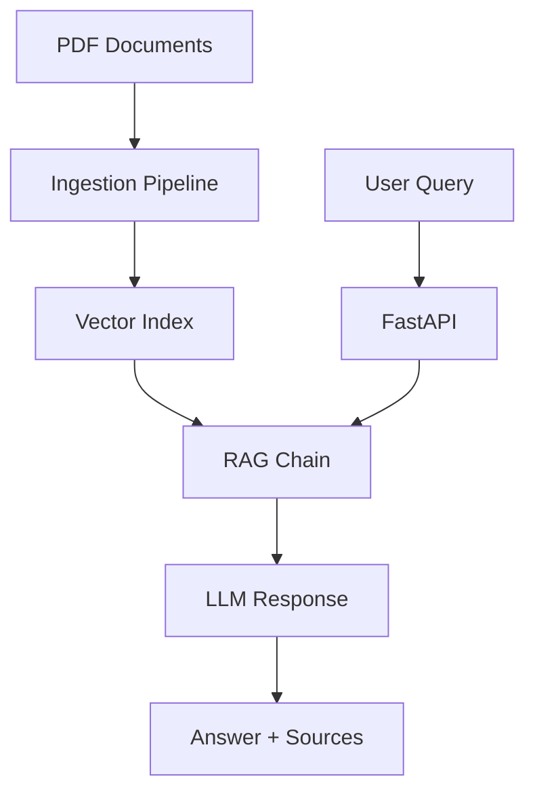

# DocuRAG

A scalable document retrieval-augmented generation (RAG) system built with LangChain and FastAPI.

[](https://github.com/your-username/DocuRAG/actions)
[](https://www.python.org/downloads/)
[](https://github.com/psf/black)
[](https://opensource.org/licenses/MIT)

## Features

- 🚀 **Fast API**: High-performance async API with FastAPI
- 📚 **Document Processing**: Automated PDF ingestion and chunking
- 🔍 **Vector Search**: FAISS and Chroma vector store support
- 💬 **Conversational RAG**: Context-aware question answering
- 🐳 **Docker Ready**: Containerized deployment with Docker Compose
- 📊 **Benchmarking**: Built-in performance testing tools
- 🔄 **Streaming**: Real-time response streaming (stretch goal)
- ☸️ **Kubernetes**: Production-ready Helm charts

## Quick Start

### Prerequisites

- Python 3.11+
- Docker and Docker Compose (optional)
- OpenAI API key (for production mode)

## Development Mode (No API Key Required)

Perfect for testing and development without OpenAI costs!

### 1. Automated Setup

```bash
# Clone the repository
git clone https://github.com/your-username/DocuRAG.git
cd DocuRAG

# Install dependencies
pip install -r requirements.txt

# Run automated development setup
python scripts/setup_dev.py
```

This will:
- Create test PDF documents
- Set up development configuration
- Build a local vector index with mock embeddings
- Verify the installation

### 2. Start Development Server

```bash
# Start the development server
python src/app/main.py

# Or with Docker
docker-compose --profile dev up inference-dev
```

The API will be available at `http://localhost:8000` with:
- 🔧 **Mock LLM**: No API key required
- 📚 **Sample Documents**: Pre-generated test PDFs
- 🚀 **Fast Responses**: Simulated AI responses
- 📖 **Full API**: All endpoints functional

### 3. Test the Development Setup

```bash
# Run automated demo
python scripts/demo.py

# Or test manually
curl http://localhost:8000/healthz
curl -X POST http://localhost:8000/query \
  -H "Content-Type: application/json" \
  -d '{"question": "What is machine learning?"}'

# View API documentation
open http://localhost:8000/docs
```

## Production Mode (OpenAI API Required)

### 1. Environment Setup

```bash
# Copy production environment template
cp .env.production .env

# Edit .env and add your OpenAI API key
export OPENAI_API_KEY="your-api-key-here"
```

### 2. Add Your Documents

```bash
mkdir -p data
# Copy your PDF files to the data/ directory
```

### 3. Production Setup

```bash
# Run production setup
python scripts/setup_prod.py

# Or manual setup
python src/ingest/build_index.py --pdf_dir ./data --out ./index --store faiss
```

### 4. Start Production Server

```bash
# Direct Python
ENVIRONMENT=production python src/app/main.py

# Or with Docker
ENVIRONMENT=production docker-compose up --build
```

## Environment Modes

DocuRAG supports three distinct modes:

| Mode | API Key | LLM | Use Case |
|------|---------|-----|----------|
| **Development** | ❌ Not required | Mock LLM | Local development, testing |
| **Testing** | ❌ Not required | Mock LLM | Unit tests, CI/CD |
| **Production** | ✅ Required | OpenAI GPT | Live deployment |

### Switching Modes

```bash
# Development (default)
export ENVIRONMENT=development

# Production
export ENVIRONMENT=production

# Testing
export ENVIRONMENT=testing
```

## Usage

### API Endpoints

#### Query Documents
```bash
curl -X POST http://localhost:8000/query \
  -H "Content-Type: application/json" \
  -d '{
    "question": "What are the main findings?",
    "chat_history": [
      ["Hello", "Hi! How can I help you with the documents?"]
    ]
  }'
```

#### Health Check
```bash
curl http://localhost:8000/healthz
```

#### Refresh Index
```bash
curl -X POST http://localhost:8000/refresh \
  -H "Content-Type: application/json" \
  -d '{"pdf_dir": "./new_documents"}'
```

### Python Client

```python
import requests

class DocuRAGClient:
    def __init__(self, base_url="http://localhost:8000"):
        self.base_url = base_url
    
    def query(self, question, chat_history=None):
        response = requests.post(
            f"{self.base_url}/query",
            json={"question": question, "chat_history": chat_history}
        )
        return response.json()

# Usage
client = DocuRAGClient()
result = client.query("What is this document about?")
print(result["answer"])
```

## Configuration

### Environment Variables

#### Core Settings
- `ENVIRONMENT`: Application mode (`development`, `testing`, `production`)
- `DEBUG`: Enable debug mode (`true`/`false`)
- `LOG_LEVEL`: Logging level (`DEBUG`, `INFO`, `WARNING`, `ERROR`)

#### LLM Configuration
- `OPENAI_API_KEY`: OpenAI API key (required for production)
- `OPENAI_MODEL`: OpenAI model name (default: `gpt-3.5-turbo`)
- `USE_MOCK_LLM`: Force mock LLM usage (`true`/`false`)
- `MOCK_RESPONSE_DELAY`: Mock response delay in seconds (default: `1.0`)

#### Vector Store Settings
- `VECTOR_STORE`: Vector store type (`faiss` or `chroma`, default: `faiss`)
- `INDEX_PATH`: Path to vector index directory (default: `./index`)
- `RETRIEVAL_K`: Number of documents to retrieve (default: `4`)

#### Document Processing
- `CHUNK_SIZE`: Text chunk size in tokens (default: `1000`)
- `CHUNK_OVERLAP`: Overlap between chunks in tokens (default: `100`)
- `TEST_DATA_DIR`: Directory for test/development data (default: `data/dev`)

#### API Settings
- `API_HOST`: API host address (default: `0.0.0.0`)
- `API_PORT`: API port number (default: `8000`)
- `MAX_WORKERS`: Thread pool size (default: `4`)

#### Docker Settings
- `CUDA_VERSION`: CUDA version for GPU support (optional)

### Configuration Files

DocuRAG uses environment-specific configuration files:

- `.env.development`: Development settings (mock LLM, test data)
- `.env.production`: Production settings (real OpenAI API)
- `.env.testing`: Testing settings (fast mock responses)
- `.env`: Active configuration (copy from above)

### Mock vs Real LLM

| Feature | Mock LLM (Development) | Real LLM (Production) |
|---------|----------------------|----------------------|
| **API Key** | Not required | OpenAI API key required |
| **Cost** | Free | Pay per token |
| **Speed** | Fast (configurable delay) | Variable (network dependent) |
| **Responses** | Template-based | AI-generated |
| **Offline** | Works offline | Requires internet |
| **Testing** | Perfect for CI/CD | Expensive for testing |

The system automatically chooses Mock LLM when:
- `ENVIRONMENT=development` and no `OPENAI_API_KEY`
- `ENVIRONMENT=testing`
- `USE_MOCK_LLM=true`

## Architecture



### Components

- **Ingestion Pipeline**: Processes PDFs and builds vector indices
- **RAG Chain**: LangChain-based conversational retrieval
- **FastAPI**: Async web API with automatic documentation
- **Vector Stores**: FAISS (fast) or Chroma (feature-rich)

## Development

### Setup Development Environment

```bash
# Clone and setup
git clone https://github.com/your-username/DocuRAG.git
cd DocuRAG

# Create virtual environment
python -m venv venv
source venv/bin/activate  # On Windows: venv\Scripts\activate

# Install dependencies
pip install -r requirements.txt

# Install development tools
pip install ruff black isort mypy pytest
```

### Code Quality

```bash
# Format code
black src/ tests/ scripts/
isort src/ tests/ scripts/

# Lint code
ruff check src/ tests/ scripts/

# Type checking
mypy src/

# Run tests
pytest tests/ -v --cov=src
```

### Testing

```bash
# Run all tests
pytest

# Run with coverage
pytest --cov=src --cov-report=html

# Run specific test categories
pytest -m "not slow"  # Skip slow tests
pytest tests/test_app.py  # Specific file
```

## Deployment

### Docker

```bash
# Build images
docker build -f docker/Dockerfile.inference -t docurag-api .
docker build -f docker/Dockerfile.ingest -t docurag-ingest .

# Run with GPU support
docker build -f docker/Dockerfile.inference \
  --build-arg CUDA_VERSION=11.8 \
  -t docurag-api-gpu .
```

### Kubernetes

```bash
# Deploy with Helm
helm install docurag ./deploy/helm-chart \
  --set secrets.openaiApiKey="your-api-key" \
  --set ingress.host="docurag.example.com"

# Or apply manifests directly
kubectl apply -f k8s/
```

### Production Considerations

- Use external vector store for persistence
- Implement API authentication and rate limiting
- Set up monitoring and logging
- Configure horizontal pod autoscaling
- Use HTTPS with proper certificates

## Benchmarking

Run performance benchmarks:

```bash
# Basic benchmark
python scripts/benchmark.py --requests 1000 --concurrency 10

# Save results
python scripts/benchmark.py \
  --requests 1000 \
  --concurrency 10 \
  --output benchmark-results.md
```

Example results:
| Metric | Value |
|--------|-------|
| Total Requests | 1000 |
| Success Rate | 99.8% |
| Requests/Second | 45.2 |
| Mean Response Time | 2.1s |

## Documentation

- [Architecture Guide](docs/architecture.md)
- [Ingestion Guide](docs/ingestion-guide.md)
- [API Reference](docs/api-reference.md)
- [Deployment Guide](docs/deployment.md)
- [Contributing Guide](docs/contributing.md)

## API Documentation

Interactive API documentation is available when running the server:
- **Swagger UI**: http://localhost:8000/docs
- **ReDoc**: http://localhost:8000/redoc

## Contributing

We welcome contributions! Please see our [Contributing Guide](docs/contributing.md) for details.

### Quick Contribution Steps

1. Fork the repository
2. Create a feature branch: `git checkout -b feature/amazing-feature`
3. Make your changes and add tests
4. Run quality checks: `ruff check && black --check .`
5. Commit your changes: `git commit -m 'Add amazing feature'`
6. Push to the branch: `git push origin feature/amazing-feature`
7. Open a Pull Request

## License

This project is licensed under the MIT License - see the [LICENSE](LICENSE) file for details.

## Acknowledgments

- [LangChain](https://github.com/langchain-ai/langchain) for the RAG framework
- [FastAPI](https://github.com/tiangolo/fastapi) for the web framework
- [OpenAI](https://openai.com/) for embeddings and language models
- [FAISS](https://github.com/facebookresearch/faiss) for efficient vector search

## Support

- 📖 [Documentation](docs/)
- 🐛 [Issue Tracker](https://github.com/your-username/DocuRAG/issues)
- 💬 [Discussions](https://github.com/your-username/DocuRAG/discussions)
- 📧 Email: support@docurag.com

## Troubleshooting

### Development Mode Issues

**"No module named 'pydantic_settings'"**
```bash
pip install pydantic-settings
```

**"No PDF files found"**
```bash
# Run the setup script to create test data
python scripts/setup_dev.py
```

**"Index not found"**
```bash
# Build the development index
python src/ingest/build_index.py --pdf_dir data/dev --out index/dev
```

**Import errors**
```bash
# Test the setup
python scripts/test_setup.py
```

### Production Mode Issues

**"OPENAI_API_KEY environment variable is required"**
```bash
# Set your API key
export OPENAI_API_KEY="your-api-key-here"
```

**"Rate limit exceeded"**
- Check your OpenAI API usage and limits
- Consider using smaller batch sizes for ingestion

**High memory usage**
- Reduce `CHUNK_SIZE` and `MAX_WORKERS`
- Use FAISS instead of Chroma for better memory efficiency

### Docker Issues

**"Build failed"**
```bash
# Clean Docker cache
docker system prune -a

# Rebuild from scratch
docker-compose build --no-cache
```

**"Port already in use"**
```bash
# Change the port
export API_PORT=8001
docker-compose up
```

## Roadmap

- [ ] Multi-modal document support (images, tables)
- [ ] Advanced chunking strategies
- [ ] Fine-tuned embedding models
- [ ] Real-time document updates
- [ ] Multi-tenant support
- [ ] Advanced analytics and monitoring