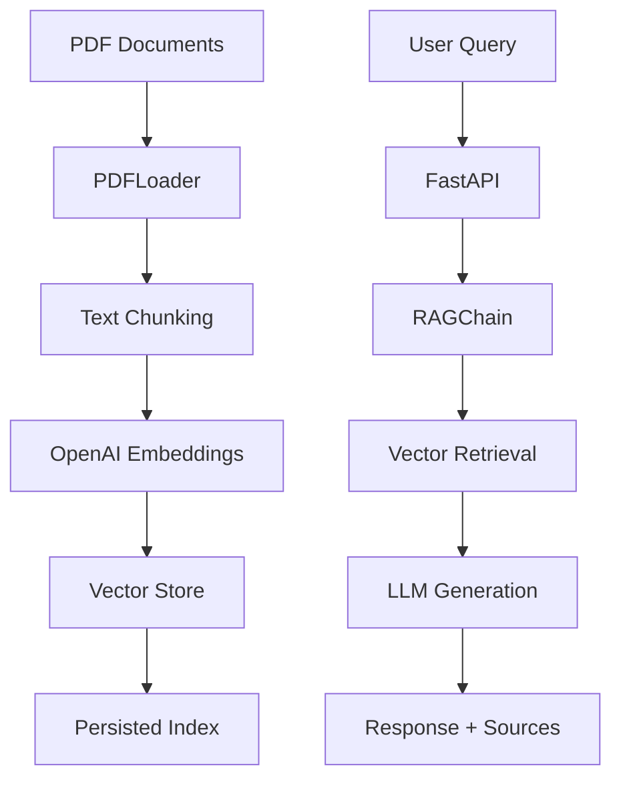

# DocuRAG Architecture

## Overview

DocuRAG is a scalable document retrieval-augmented generation (RAG) system built with LangChain and FastAPI. The system consists of two main components: an ingestion pipeline for processing documents and building vector indices, and an inference API for answering questions based on the indexed documents.

## System Components

### 1. Ingestion Pipeline

The ingestion pipeline processes PDF documents and creates searchable vector indices.

**Components:**
- `PDFLoader`: Loads and chunks PDF documents using LangChain's PyPDFLoader
- `build_index.py`: CLI tool for building vector indices from PDF directories
- Vector stores: FAISS (default) or Chroma for storing document embeddings

**Process:**
1. Load PDF files from specified directory
2. Split documents into chunks (1000 tokens with 100 token overlap)
3. Generate embeddings using OpenAI's embedding model
4. Store embeddings in vector database
5. Persist index to disk

### 2. Inference API

The inference API provides endpoints for querying documents and managing the system.

**Components:**
- `RAGChain`: LangChain-based conversational retrieval chain
- `FastAPI`: Web framework for API endpoints
- Thread pool executor for non-blocking operations

**Endpoints:**
- `POST /query`: Query documents with conversational context
- `POST /refresh`: Rebuild vector index from new documents
- `GET /healthz`: Health check endpoint
- `POST /query/stream`: Streaming responses (stretch goal)

### 3. Data Flow



## Technology Stack

### Core Technologies
- **Python 3.11**: Runtime environment
- **LangChain**: RAG framework and document processing
- **FastAPI**: Web API framework
- **OpenAI**: Embeddings and language model
- **FAISS/Chroma**: Vector databases

### Infrastructure
- **Docker**: Containerization
- **Docker Compose**: Multi-service orchestration
- **GitHub Actions**: CI/CD pipeline

### Development Tools
- **Ruff**: Linting and formatting
- **Black**: Code formatting
- **Pytest**: Testing framework
- **Pydantic v2**: Data validation

## Scalability Considerations

### Performance Optimizations
1. **Async Processing**: FastAPI with async endpoints
2. **Thread Pool**: Non-blocking I/O for retrieval and generation
3. **Efficient Vector Search**: FAISS for fast similarity search
4. **Chunking Strategy**: Optimized chunk size and overlap

### Resource Management
1. **Memory**: Efficient vector storage and retrieval
2. **CPU**: Multi-threaded processing for concurrent requests
3. **GPU**: Optional CUDA support for faster inference
4. **Storage**: Persistent vector indices

### Horizontal Scaling
1. **Stateless API**: No server-side session storage
2. **Shared Storage**: Vector indices can be shared across instances
3. **Load Balancing**: Multiple API instances behind load balancer
4. **Microservices**: Separate ingestion and inference services

## Security Considerations

### API Security
- Environment variable configuration for sensitive data
- Input validation with Pydantic models
- Error handling without information leakage

### Data Privacy
- Local vector storage (no external dependencies for inference)
- Configurable OpenAI API usage
- Document metadata preservation

## Deployment Architecture

### Development
```
Local Machine
├── Docker Compose
│   ├── Ingestion Service
│   └── Inference Service
└── Shared Volumes
    ├── PDF Documents
    └── Vector Index
```

### Production (Kubernetes)
```
Kubernetes Cluster
├── Ingestion Job (CronJob)
├── Inference Deployment
│   ├── Multiple Replicas
│   └── Load Balancer
├── Persistent Volumes
│   ├── Document Storage
│   └── Index Storage
└── ConfigMaps/Secrets
```

## Configuration

### Environment Variables
- `OPENAI_API_KEY`: OpenAI API key for embeddings and LLM
- `VECTOR_STORE`: Vector store type (faiss/chroma)
- `INDEX_PATH`: Path to vector index directory
- `CUDA_VERSION`: Optional CUDA version for GPU support

### Runtime Configuration
- Chunk size and overlap for document processing
- Vector store parameters (similarity threshold, top-k)
- LLM parameters (temperature, model selection)

## Monitoring and Observability

### Health Checks
- API health endpoint
- Vector store connectivity
- OpenAI API availability

### Metrics
- Request latency and throughput
- Vector search performance
- LLM generation time
- Error rates and types

### Logging
- Structured logging with timestamps
- Request/response logging
- Error tracking and alerting